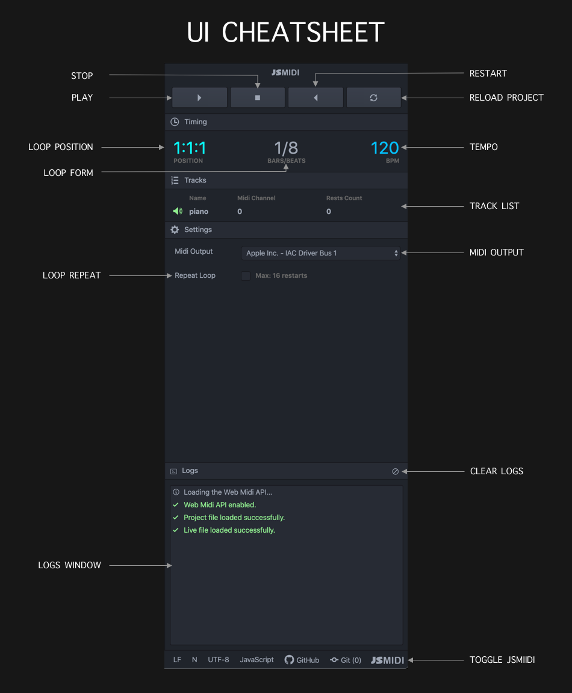

  

   
  

    JSMidi is a music production tool that works directly with your Digital Audio
    Workstation (DAW) via MIDI. The JSMidi Atom Plugin enables you to build songs and
    live code right inside Atom.
  

  

    Please read the <a href="https://github.com/aaronats/jsmidi">JSMidi Documentation</a>
    for detailed instructions on JSMidi. Below is cheatsheet of UI.
  

   
  

